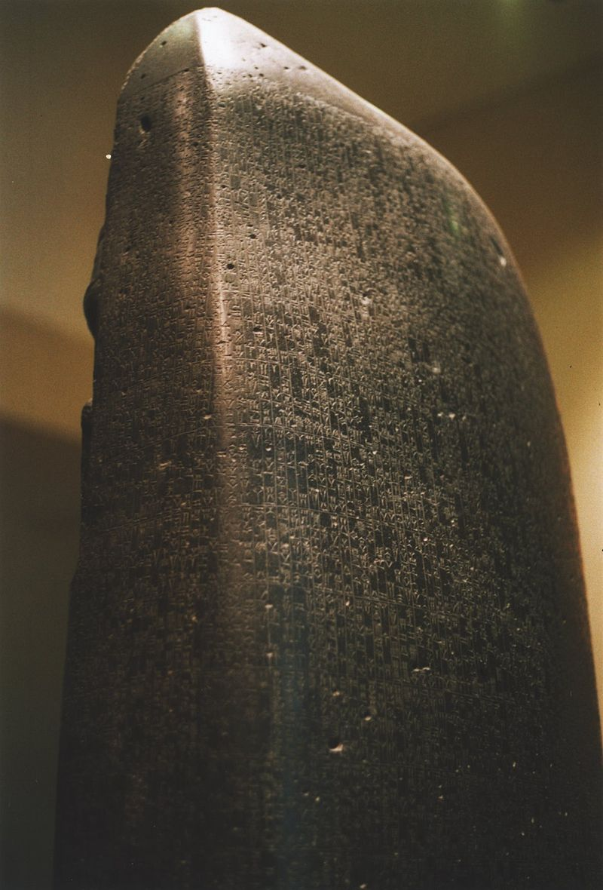
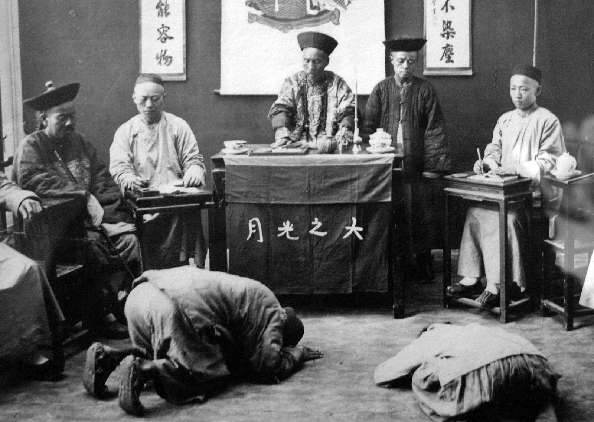
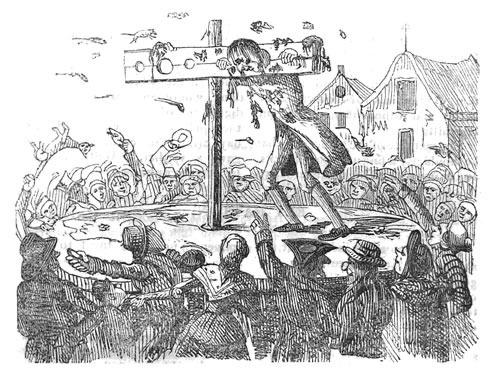
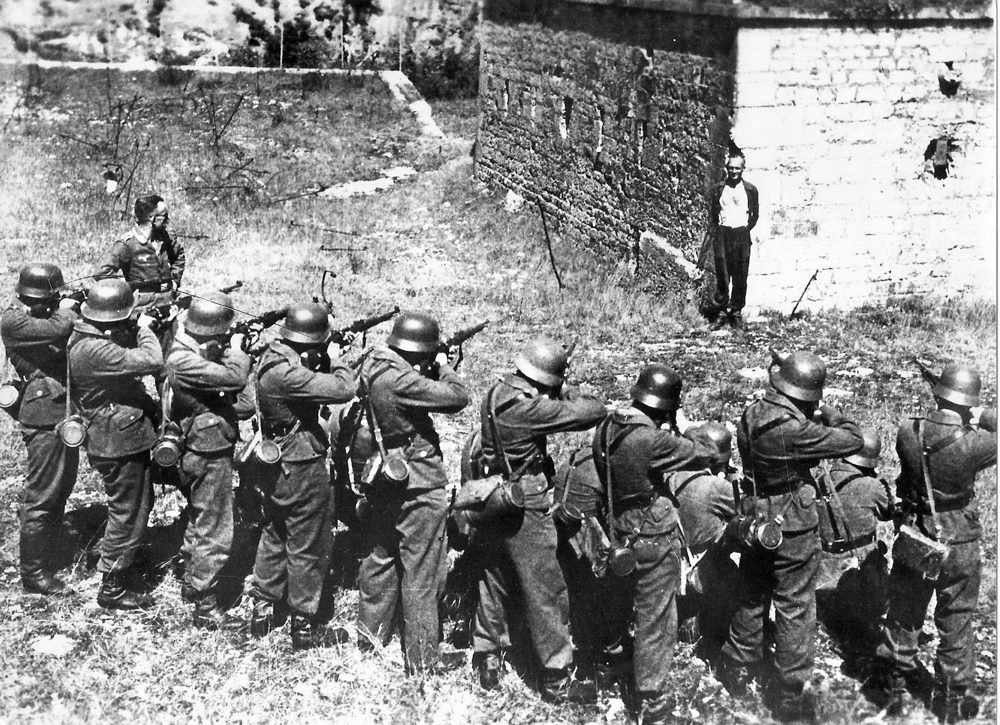

## Punishment Project Information

<h2>Code of Hammurabi</h2>

One of the oldest forms of law that uses capital punishment is the Code of Hammurabi, dating back to the 1700's BC. This used social classes fo the victim and also the criminal, and death could be decided as one of the punishments for crimes.

<h2>Draco and Ancient Greece</h2>

During ancient Greece, Draco was the first to write down laws for the legal system. In this set of laws, there were many references to punishment by death penalty.

<h2>Tang Dynasty</h2>

The Tang Dynasty punished a total 233 different crimes until, Emperor Xuanzong ordered that what would be the death penalty would be substituted with a punishment similar.

<h2>Bloody Code</h2>
[//]: # 1800's AD

In the 1600's and 1700's England, there were no police, and there wasn't a set system of judgment. For many crimes, including some that would be minor today, death penalty was enforced on them.

<h2>Nazis</h2>

[//]: # 1900's AD

During the Nazi regime, there were three types of capital punishment: hanging, decapitation, and firing squad. These were used as a way to keep the military in line. Different acts relating to deserting the military cause were punishable by death. Some firing squads consisted of one bullet, which would be shot at the head or neck.

<h2>Abolition</h2>

[comment]: <> 2000's AD

In the modern times, countries have started to abolish the death penalty. These countries include  Australia, Canada, New Zealand, and many others. The United States is unique, because it is a very controversial topic. The first state to eliminate capital punishment was Michigan in 1846, while some states like Pennsylvania still allow capital punishment.

"<h2>Code of Hammurabi</h2>\n\n
One of the oldest forms of law that uses capital punishment is the Code of Hammurabi, dating back to the 1700's BC. This used social classes fo the victim and also the criminal, and death could be decided as one of the punishments for crimes.
","<h2>Draco and Ancient Greece</h2>\n\n
During ancient Greece, Draco was the first to write down laws for the legal system. In this set of laws, there were many references to punishment by death penalty.
","<h2>Tang Dynasty</h2>\n\n
The Tang Dynasty punished a total 233 different crimes until, Emperor Xuanzong ordered that what would be the death penalty would be substituted with a punishment similar.
","<h2>Bloody Code</h2>\n
In the 1600's and 1700's England, there were no police, and there wasn't a set system of judgment. For many crimes, including some that would be minor today, death penalty was enforced on them.
","<h2>Nazis</h2>\n\n
During the Nazi regime, there were three types of capital punishment: hanging, decapitation, and firing squad. These were used as a way to keep the military in line. Different acts relating to deserting the military cause were punishable by death. Some firing squads consisted of one bullet, which would be shot at the head or neck.
","<h2>Abolition</h2>\n\n
In the modern times, countries have started to abolish the death penalty. These countries include  Australia, Canada, New Zealand, and many others. The United States is unique, because it is a very controversial topic. The first state to eliminate capital punishment was Michigan in 1846, while some states like Pennsylvania still allow capital punishment.
"
